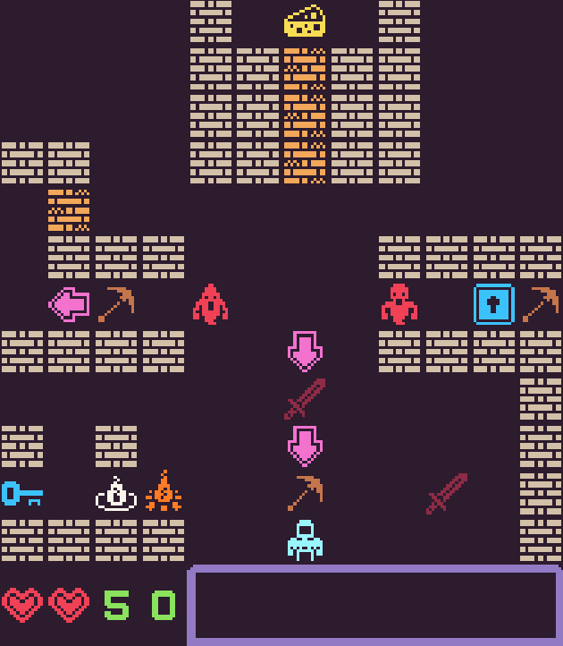

# CheeseBot6000

### About
CheeseBot6000 is a puzzle game about a robot eating cheese.
The game itself can be found ([here](http://mustbeatomic.itch.io/cheesebot-6000))

Note that this repo only contains the code.lua file.

Made with the ([Pixel 8 Fantasy Console](http://pixelvision8.itch.io/pv8)), for the ([Miz Game Jam 1](http://itch.io/jam/miz-jam-1)).

### Screenshots

### License

Licensed under the [Microsoft Public License (MS-PL) License](https://opensource.org/licenses/MS-PL).  See LICENSE file in the project root for full license information.
